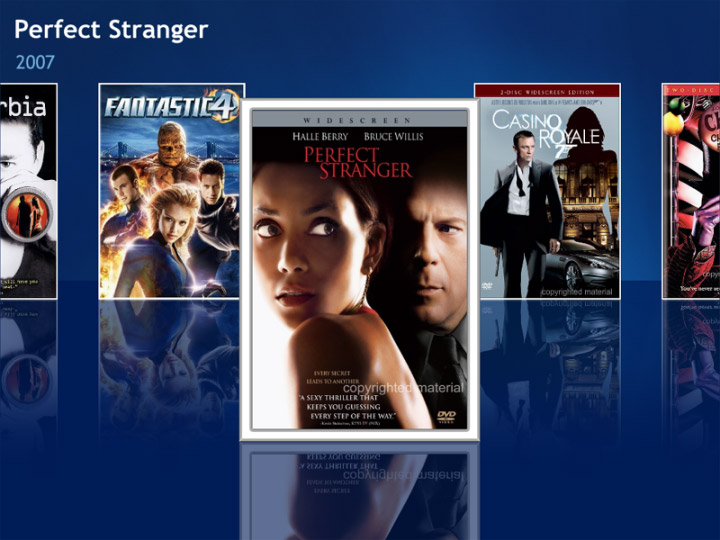

# FFCG.Leijon.Movies

Composable.Monolithic is a framework for [Composability](https://en.wikipedia.org/wiki/Composability) in Software Development available for .NET.

Current version is 1.0, released in 2014.

[TOC]

## Overview
* [Use Case](doc/md/usage.md) — Overview of the projects use case and why it's being done.
* [Project Plan](doc/md/projectplan.md) - Projectplan with relevant material
* [Trello](https://trello.com/b/wzRKEJoC/moviecollector) - A great way to use cards to imply responsibility for an Agile Development
* [FAQ](faq.html) — Questions and Answers that can be worth to investigate.

## Research-markdowns

* [imdb](doc/imdb.md) - Research and information about imdb api
* [recommender-systems](doc/recommender.md) - Recommendation sustems and what to use

## Related Projects and Resources

Here we can list related projects and resources to this project.

* [Developers Guide for new Recruits at Manpower](http://devteam-wiki.mpsedev.local/) - Need to have account to get into the link

## Tool Stack
 * [Balsamic](https://balsamiq.com/) - Sketching up wireframes
 * [Resharper](https://www.jetbrains.com/resharper/?gclid=CNzVhbjPtcoCFWXecgod_0wGWQ&gclsrc=aw.ds) - Tool for Visual Studio to help with development

## Tech Stack

### Frontend
* ** Typescript + Angular **

### Backend
* [** Neo4J**](http://neo4j.com/)
* **C#**